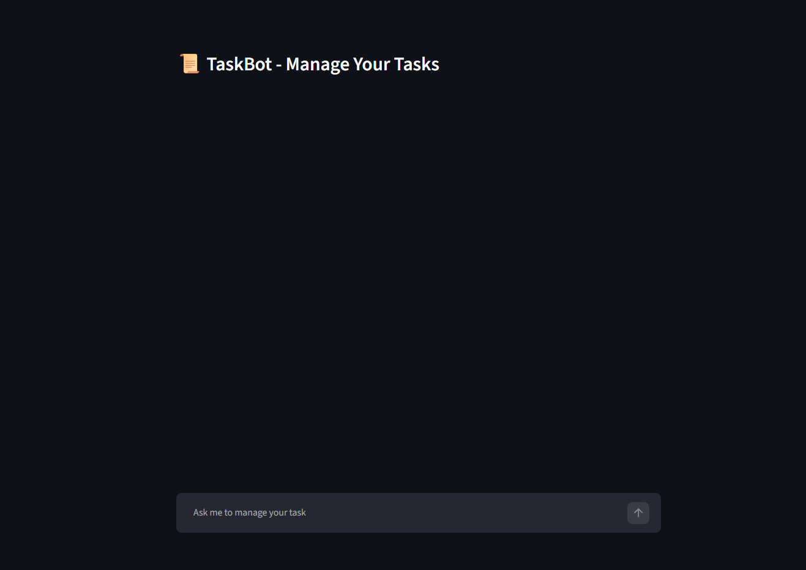
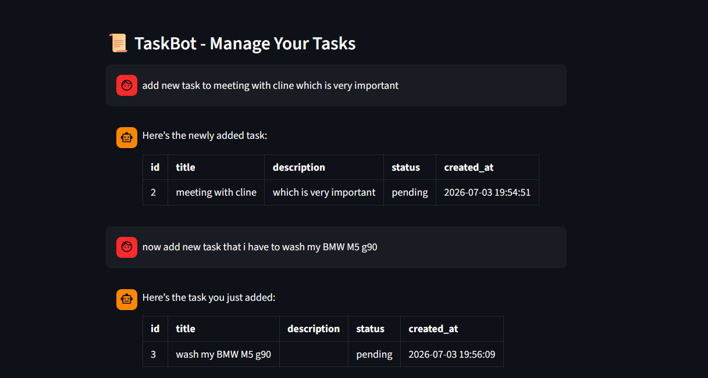

# 🤖 SQL Agent for Task Management (Agentic AI)

An AI-powered SQL Agent that enables users to manage and interact with a task management database using natural language. Built using **LangChain**, **LangGraph**, **Groq LLM**, **SQLDatabaseToolkit**, and **Streamlit**, the application automatically converts user requests into SQL queries, executes them on the database, and returns intelligent, context-aware responses.

---

## 🚀 Features

- 💬 Query a SQL database using natural language.
- 🤖 AI-powered SQL generation using Large Language Models.
- 📝 Create, update, retrieve, and analyze task records.
- 🧠 Conversational memory for multi-turn interactions.
- 🔧 Agent-based tool calling using LangChain.
- ⚡ Fast response generation using Groq LLM.
- 📊 Interactive Streamlit web interface.
- 🔄 Modular and reusable project architecture.

---

## 🏗️ System Architecture

```
User Query
      │
      ▼
Streamlit Interface
      │
      ▼
LangChain Agent
      │
      ▼
SQLDatabaseToolkit
      │
      ▼
SQL Database
      │
      ▼
Query Execution
      │
      ▼
Groq LLM
      │
      ▼
AI Response
```

---

## 🛠️ Tech Stack

### Programming Language
- Python

### AI Frameworks
- LangChain
- LangGraph

### Large Language Model
- Groq LLM

### Database
- SQL Database
- SQLDatabase
- SQLDatabaseToolkit

### Frontend
- Streamlit

### AI Concepts
- Agentic AI
- Tool Calling
- Conversational Memory
- Prompt Engineering
- Natural Language to SQL
- Structured Outputs

---

## 📁 Project Structure

```
project/
│
├── app.py                 # Streamlit application
├── requirements.txt
└── README.md
```

---

## ⚙️ Workflow

1. User enters a task-related query in natural language.
2. LangChain Agent interprets the request.
3. SQLDatabaseToolkit selects the appropriate database tool.
4. The LLM generates or validates the SQL query.
5. SQL query is executed on the database.
6. Results are processed and returned in natural language.
7. Conversation history is maintained using LangGraph Memory.

---

## 💡 Example Queries

- Show all pending tasks.
- Add a new task for tomorrow.
- Update the status of Task 12 to Completed.
- Delete completed tasks.
- List overdue tasks.
- Count the number of pending tasks.
- Show tasks assigned this week.
- Which employee has the most pending tasks?

---

## ✨ Key Features

- Natural Language to SQL conversion.
- Agent-based reasoning and tool selection.
- Context-aware conversations using memory.
- SQL query automation.
- Intelligent task management.
- Modular architecture for easy extension.
- Scalable AI-powered database assistant.

---

## 📊 Technologies Used

- Python
- Streamlit
- LangChain
- LangGraph
- Groq
- SQLDatabase
- SQLDatabaseToolkit
- MySQL 
- Agentic AI

---

## 📈 Future Improvements

- User authentication and role-based access.
- Multi-database support (MySQL, PostgreSQL, SQL Server).
- Dashboard with task analytics.
- Voice-based interaction.
- Calendar integration.
- Email and Slack notifications.
- Cloud deployment.
- Multi-agent architecture.

---

## 🎯 Learning Outcomes

This project helped me gain practical experience in:

- Building AI Agents using LangChain.
- Developing Natural Language to SQL applications.
- Tool Calling and Agentic AI workflows.
- Working with Large Language Models (Groq).
- Integrating SQL databases with LLMs.
- Managing conversational memory using LangGraph.
- Prompt Engineering for structured AI responses.
- Developing AI-powered web applications using Streamlit.

---

## 📷 Screenshots

### Home Page




### Query & Response Example




---

## 📦 Installation

### Clone the Repository

```bash
git clone https://github.com/trailokya-world/sql-agent-task-management.git
cd sql-agent-task-management
```

### Install Dependencies

```bash
pip install -r requirements.txt
```

### Run the Application

```bash
streamlit run app.py
```

---

## 👨‍💻 Author

**Trailokya Dhotre**

- GitHub: https://github.com/trailokya-world
- LinkedIn: *(Add your LinkedIn profile)*